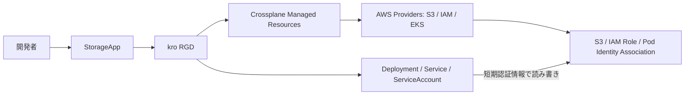

# kro-crossplane-eks-idp-lab

KRO + Crossplane + EKSで「S3付きアプリ」をセルフサービス化する、記事・IDP学習用のラボです。
ひとつの `StorageApp` からアプリ、専用S3、IAMロール、EKS Pod Identityを用意します。
Ready判定、権限不足からの復旧、アプリ削除後のデータ保持と再接続まで検証します。

**実行済みの検証結果は [docs/verification.md](docs/verification.md) に記録します。**
2026-10-02に新規EKS上で、実S3の読み書き・権限不足からの復旧・削除後の保持と再接続を検証しました。
[記事用スクリーンショット](docs/screenshots/) と [実環境で見つけた注意点](docs/verification.md#実awsで見つかった3点と修正) も残しています。
CIはPRとmainへの取り込み時に実行し、`Run workflow` からの手動実行にも対応します。



CrossplaneのCompositionは使わず、KROがnamespaced Managed Resourceを直接生成します。
Crossplane v2単独でもKubernetesリソースを合成できるため、これは学習のための設計上の選択です。
EKSとProviderの認証はeksctl / CloudFormationで先に用意し、起動依存を避けます。

## バージョン

| コンポーネント | 固定値 |
|---|---|
| KRO / Helm chart | 0.9.4 |
| Crossplane / Helm chart | 2.4.2 |
| AWS Provider（family / s3 / iam / eks） | 2.8.1 |
| EKS | 1.36（パッチとplatformVersionは実環境で記録） |
| kindのKubernetes | 1.36.4、digest固定 |
| Go | 1.27.1、ビルダーイメージdigest固定 |
| Helm / eksctl / kind | 3.22.0 / 0.230.0 / 0.33.0 |

一覧は [versions.env](versions.env)、Helmパッケージのハッシュは [charts.sha256](charts.sha256)。
AWS SDKは `app/go.mod` / `app/go.sum`、CRDはProvider 2.8.1のスナップショットとSHA256で固定します。
EKSアドオンは初回作成時に1.36対応版を解決して `.local/addons.json` に保存し、再実行で再利用します。
AWSが管理するEKSパッチやAMIを、永久に固定するという意味ではありません。

今回のnamespaced MRは `*.aws.m.upbound.io/v1beta1` を使い、`deletionPolicy` を持ちません。
S3保持は `managementPolicies: [Observe, Create, Update, LateInitialize]` で指定します。
`providerConfigRef` には `name` と `kind` の両方が必要です。

## 開発者に渡すAPI

```yaml
apiVersion: platform.example.com/v1alpha1
kind: StorageApp
metadata:
  name: demo
  namespace: idp-lab
spec:
  storageId: demo
  image: ACCOUNT.dkr.ecr.ap-northeast-1.amazonaws.com/idplab-LAB/storage-api@sha256:DIGEST
  replicas: 1
```

`storageId` は2〜16文字の小文字英数字・ハイフンで、先頭は英字、末尾は英数字。作成後は変更できません。
同じラボ内ではひとつのStorageAppだけがそのIDを使います。削除完了後に同じIDで作り直すと、保持したバケットへ再接続します。
APIは1〜3レプリカを許可します。リージョン、IAM権限、バケットの公開設定は管理者の設定です。

## 前提と準備

- AWS CLI v2と検証アカウントへのSSOアクセス
- Go 1.27.1、kubectl 1.36、make、uv、curl、jq、Docker
- 検証中のEKS / EC2 / EBS / public IPv4 / S3 / ECR等の料金

ワーカーノードは `m7i.xlarge` 1台。NAT Gatewayや外部Load Balancerは作りません。
公開サブネットのノードからAWS APIへ接続します。SSHは無効、Kubernetes APIの公開アクセスは管理者のIPv4 /32に限定します。
ネットワーク構成と可用性は短時間の検証用です。

```bash
cp .env.example .env
# プロファイル、期待するアカウントID、リージョン、一意なLAB_ID、自分のIPv4/32を設定
aws sso login --profile YOUR_PROFILE
make tools
export PATH="$PWD/.local/bin:$PATH"
```

`.env`、`.local/`、kubeconfig、ログはGitに含めません。
実アカウントと `EXPECTED_ACCOUNT_ID` が異なる場合は操作を止めます。

## 作成と検証

次を順番に実行します。各ターゲットは `scripts/*.sh` を呼ぶため、直接実行しても構いません。

```bash
make check test     # 静的検査、単体テスト、race detector
make graph          # kind + 実KRO + 実CRD。AWSのstatusのみ模擬
make cluster        # EKS、VPC、ノード、Pod Identity Agent等
make bootstrap      # Provider用IAM、権限境界、Pod Identity、ECR
make platform       # KRO、Crossplane、6種類のMR、RBAC
make image          # ECRへpushし、digestを保存
make demo           # 開発者ServiceAccountとしてStorageAppを作成
make verify         # HTTPバイナリ往復・404・RBAC
make verify-iam     # IAMシミュレーターで権限境界を評価
make failure        # 一時的なDeny→Ready=False→権限復旧
make retention      # アプリ削除→S3保持→再接続→元データをHTTP GET
make cleanup        # EKS・VPC・ECR・IAMを削除。S3は保持
```

`make cluster` は新規作成用です。既存EKSのアップグレードには使いません。
作成途中の障害や後片付けは [docs/operations.md](docs/operations.md) を参照してください。

## アプリを触る

```bash
export KUBECONFIG="$PWD/.local/kubeconfig"
kubectl -n idp-lab get storageapp demo -o yaml
kubectl -n idp-lab port-forward service/storage-demo 8080:80 --address=127.0.0.1
# 別ターミナル
curl -f -X PUT --data-binary 'hello idp' http://127.0.0.1:8080/objects/hello.txt
curl -f http://127.0.0.1:8080/objects/hello.txt
```

| API | 意味 |
|---|---|
| `GET /healthz` | 生存確認。AWS障害でも成功 |
| `GET /readyz` | Pod専用オブジェクトをPut/Get/Deleteし、内容一致を確認 |
| `PUT /objects/{key}` | 最大1 MiBを `uploads/` 配下へ保存 |
| `GET /objects/{key}` | 最大1 MiBを取得。存在しなければ404 |

公開HTTP認証は実装していません。ClusterIPとlocalhostのport-forwardで使います。
readiness probeはS3 APIリクエストを発生させます。障害時に一時オブジェクトの削除に失敗した場合も、
同じPodの `_health/` キーを再利用し、ユーザーデータは削除しません。

## 権限と運用の境界

- ProviderもアプリもPod Identityを使用。AWSアクセスキーを保存しない。
- Providerの権限をS3 / IAM / EKSに分離し、ラボの名前・IAMパス・クラスタに限定。
- アプリIAMロールの作成時にpermissions boundaryを必須化。IAM Providerは境界を外せない。
- アプリは自身のバケットだけにアクセス。ユーザーオブジェクトの削除権限は持たない。
- Pod Identityの信頼条件をクラスタARN、Namespace、ServiceAccountに限定。
- Association直後の注入遅延に備え、アプリのIPv4用認証環境変数と専用トークン投影を明示。
- KROのRBACはaggregationで必要な型だけ追加。開発者はMRやConfigMapを書き換えられない。
- S3の公開ブロックとAES256暗号化も、アプリ削除時に保持。
- アプリは非root、read-only filesystem、capabilitiesなし。

共有Namespaceの学習デモです。悪意ある利用者間の分離、イメージ許可制、監査・バックアップ・保持期限・
管理クラスタの復旧・RGDの段階的更新は、自社IDPへの採用前に別途設計が必要です。

## 参考

- [KRO 0.9.4](https://github.com/kubernetes-sigs/kro/releases/tag/v0.9.4)
- [Crossplane 2.4.2](https://github.com/crossplane/crossplane/releases/tag/v2.4.2)
- [AWS Provider 2.8.1](https://github.com/crossplane-contrib/provider-upjet-aws/releases/tag/v2.8.1)
- [Crossplane v2の変更](https://docs.crossplane.io/v2.4/whats-new/)
- [EKS Pod Identityの信頼ポリシー](https://docs.aws.amazon.com/eks/latest/userguide/pod-id-role.html)
- [記事用メモ](docs/article-notes.md)
